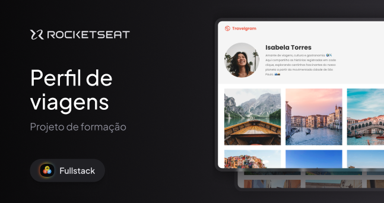

<h1> 🚀 Desafio prático - Local Turístico</h1>

  

 

## 🚀 Tecnologias

Esse projeto foi desenvolvido com as seguintes tecnologias:

- HTML e CSS
- Git e Github
- Figma

 

## 💻 Projeto

Página web de diagrama de viagens. 
Este projeto foi realizado no curso de Fullstack da Rocketseat.
